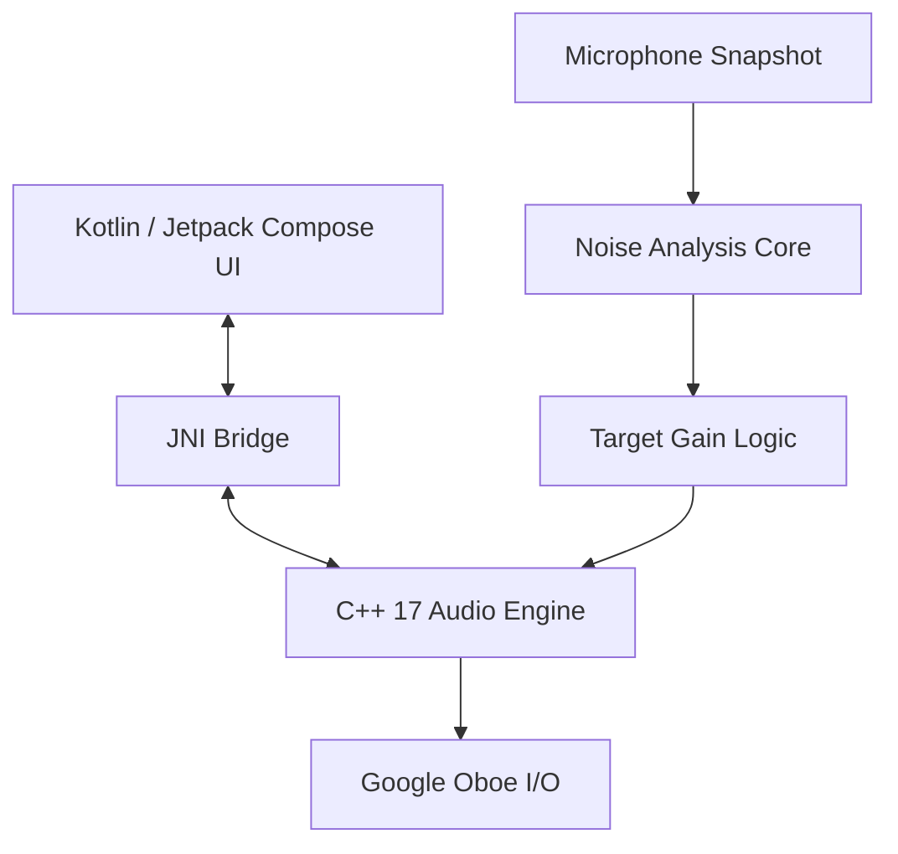

# 🎧 스마트 적응형 EQ 뮤직 플레이어 (EnviroTune)

  
  
  
  
  

**EnviroTune (Intelligent Ambient Noise Compensation System)**은 주변 소음을 분석하여 시끄러운 환경에서도 조용한 방에서 음악을 듣는 것과 같은 **'청감적 밸런스(Perceptual Consistency)'**를 유지해 주는 고급 안드로이드 뮤직 플레이어입니다.

- **개발 기술 문서:** [PRD.md](http://10.0.35.212:3000/admin/kotlin_smart_adaptive_EQ/src/branch/main/docs/PRD.md)
- **연구 보고서 (구현 핵심):** [RESEARCH_REPORT_APPROXIMATION_MODELS.md](http://10.0.35.212:3000/admin/kotlin_smart_adaptive_EQ/src/branch/main/docs/RESEARCH_REPORT_APPROXIMATION_MODELS.md)
- **이론적 배경 (심리음향학):** [ADAPTIVE_EQ_THEORY.md](http://10.0.35.212:3000/admin/kotlin_smart_adaptive_EQ/src/branch/main/docs/ADAPTIVE_EQ_THEORY.md)
- **⚠️ 개발자 노트 (구현 현황):** [DEV_IMPLEMENTATION_NOTES.md](http://10.0.35.212:3000/admin/kotlin_smart_adaptive_EQ/src/branch/main/docs/DEV_IMPLEMENTATION_NOTES.md)

---

## 리스닝 모드 (현재 구현)
- **Pure EQ:** 원음의 결을 살리면서 차분하고 편안한 인상을 줍니다. 공간감과 자연스러움이 잘 살아납니다.
- **Maximizer:** 존재감과 에너지감을 강조해 선명하고 힘 있게 들립니다. 몰입감이 높아집니다. *(Android 9+에서 동작)*

### 감성적 차이 요약
- **Pure EQ:** 자연스러움, 여백, 부드러움
- **Maximizer:** 밀도감, 선명도, 임팩트

### 기술적 차이 (현재 구현 기준)
- **신호 경로:** Pure EQ는 출력 체인을 단순화하여 원음 중심으로 재생하고, Maximizer는 `DynamicsProcessing` 기반 **20밴드 Pre‑EQ + Limiter**를 사용합니다.
- **Limiter 구성:** threshold `-2dB`, ratio `10:1`, attack `1ms`, release `60ms`로 설정되어 안정적인 레벨 유지와 선명한 존재감을 제공합니다.
- **변화 적용 방식:** `smoothingFactor=0.1`로 100ms 단위의 점진적 변화가 적용되어 부드러운 전환을 목표로 합니다.
- **모드 적용 조건:** Maximizer는 Android 9+에서 사용 가능하며, 유효한 `audioSessionId`가 확보될 때 활성화됩니다.

### 테스트 모드 (개발용)
- **Test EQ:** 1k~4kHz 중심 +8dB 부스트로 중역/고역 체감 확인용.
- **Alt EQ (Low/High 3s):** 저역 5밴드 ↔ 고역 5밴드가 3초마다 번갈아 적용.
- **Alt EQ (Low/Mid/High 3s):** 저역 → 중역 → 고역 순서로 3초 간격 순환 적용.

---

## 1. ✨ 핵심 기능

- **🧠 청감적 밸런스 유지 (Perceptual Consistency):** 소음에 의해 마스킹(Masking)되는 주파수 대역만 스마트하게 보정하여 원음의 왜곡을 최소화합니다.
- **🔋 배터리 최적화:** 실시간 상시 분석 대신 **'스냅샷(Smart Scan, 1초)'** 방식을 사용하여 배터리 소모를 획기적으로 줄였습니다.
- **🔄 자동 루프 테스트 (Auto-Loop Test):** 개발 및 튜닝을 위해 1초 녹음 -> 2초 대기를 무한 반복하는 자동화 테스트 모드를 제공합니다.
- **🎼 음악 전용 튜닝:** 음악의 왜곡(Distortion)과 탁함(Muddiness)을 방지하도록 설계된 고음질 전용 보정 알고리즘을 적용했습니다.
- **🌗 적응형 EQ 엔진:** 20-밴드 동적 IIR 필터 뱅크를 통해 소음 변화에 따라 EQ 설정을 부드럽게 전환합니다.
- **🔊 ISO 226 보정 (Loudness Contour):** 인간의 청각 특성을 반영하여 볼륨 크기에 따라 저음과 고음을 자동으로 보정합니다.

---

## 2. 🏗️ 시스템 아키텍처

저지연(Low-latency) 오디오 처리를 위해 Kotlin UI 레이어와 C++ 기반의 오디오 엔진이 결합된 하이브리드 구조로 설계되었습니다.

### 2.1 기술 스택 (Tech Stack)
| 컴포넌트 | 기술 | 설명 |
| :--- | :--- | :--- |
| **User Interface** | Kotlin / Jetpack Compose | 플레이어 UI, 권한 관리, 백그라운드 서비스, **Auto Test Mode** |
| **Audio I/O** | **Google Oboe** | 저지연 오디오 스트림 관리 (AAudio/OpenSL ES) |
| **DSP Core** | **C++ 17** | 실시간 오디오 처리 및 20-밴드 Biquad IIR 필터 |
| **FFT Library** | Custom Iterative FFT | In-place Cooley-Tukey FFT (Hann window, zero padding) |
| **Sensing** | Activity Recognition API | 사용자 움직임 감지를 통한 분석 트리거 |

---

## 3. ⚙️ 기술 특징 (Technical Highlights)

### 3.1 20-밴드 적응형 필터 뱅크
0.5 옥타브 간격의 피킹 필터를 사용하며, 자연스러운 소리를 위해 넓은 Q-값(1.4 ~ 2.0)을 적용합니다.

- **서브/저역 (Band 0-5):** 차량 및 엔진 소음 보정. 현재 구현 기준 최대 +5dB 부스트.
- **중저역 (Band 6-9):** 음의 명료도를 위해 플랫(Flat) 유지 또는 소폭 감쇄.
- **중고역 (Band 10-13):** 보컬 영역 마스킹 시 소폭 부스트.
- **고역 (Band 14-19):** 디테일 유지를 위한 하이 쉘프(High Shelf) 부스트.

### 3.2 스마트 스캔 트리거 (Trigger)
효율적인 전력 관리를 위해 특정 이벤트 발생 시에만 소음을 분석합니다.
1. **곡 변경 (Track Change):** 곡 사이의 무음 구간을 활용.
2. **움직임 감지 (Motion Change):** 정지 상태에서 걷거나 차량 탑승 시 트리거.
3. **수동 스캔:** 사용자가 직접 새로고침 버튼을 눌렀을 때.
4. **Auto-Loop Mode:** (Dev Only) 1초 녹음 -> 2초 대기를 무한 반복하며 로그 수집.

### 3.3 전환 로직 (Transition)
새로운 소음 환경이 감지되면:
- **부드러운 전환:** 현재 EQ 값에서 목표 값까지 **3초(3000ms)**에 걸쳐 서서히 변화하여 이질감을 방지합니다.
- **자동 노멀라이제이션:** 리미터(Limiter)를 적용하여 EQ 보정으로 인한 디지털 클리핑을 방지합니다.

---

## 4. 🧠 핵심 알고리즘 명세 (Algorithm Specifics)

### 4.1 주파수 분석 구역 정의 (3-Zone Analysis)
20개 밴드를 분석 효율성을 위해 3가지 핵심 구역으로 그룹화하여 처리한다.

| Zone | 명칭 | 범위 (Bands) | 주파수 대역 | 주요 소음 및 특징 |
| :--- | :--- | :--- | :--- | :--- |
| **Zone A** | **Low (저역)** | Band 1 ~ 6 | 20Hz ~ 250Hz | 엔진 소음, 진동, 공조기 소리. 에너지가 가장 큼. |
| **Zone B** | **Mid (중역)** | Band 7 ~ 14 | 250Hz ~ 4kHz | 사람 목소리, 악기 기음. **가장 중요(소리의 뼈대)**. 마스킹 심함. |
| **Zone C** | **High (고역)** | Band 15 ~ 20 | 4kHz ~ 20kHz | 바람 소리, Hiss, 공간감. 소리의 디테일 담당. |

### 4.2 음악적 튜닝 가이드 (Musical Tuning Strategy)
악기와 청감 특성을 고려하여 5단계 정밀 튜닝을 적용한다. (Broad Q-Factor 사용 필수)

1.  **Sub-Bass (20~60Hz):**
    * *Role:* 킥 드럼 초저역, 느낌(Feel).
    * *Action:* **Limit Boost.** 소음이 심해도 +3~4dB 이상 올리지 않음 (스피커 보호).
2.  **Bass (60~250Hz):**
    * *Role:* 타격감(Punch), 베이스 기타.
    * *Action:* **Active Boost (+3~9dB).** 소음에 대항하여 가장 적극적으로 보정.
3.  **Low-Mids (250~500Hz):**
    * *Role:* 악기 기음 겹침, 탁함(Mud)의 원인.
    * *Action:* **Cut or Flat (-1~-2dB).** 베이스 부스트 시 발생하는 탁한 소리를 제거하기 위해 오히려 깎음.
4.  **Upper-Mids (2~4kHz):**
    * *Role:* 보컬 가사, 존재감(Presence).
    * *Action:* **Careful Boost (+2~4dB).** 청각이 가장 예민하므로 쏘는 소리(Harsh)가 나지 않게 조심스럽게 보정.
5.  **Highs/Brilliance (6~20kHz):**
    * *Role:* 공기감(Air), 디테일.
    * *Action:* **High Shelf Boost (+3~6dB).** 답답함을 해소하고 Hi-Fi 느낌 복구.

### 4.3 소음 환경별 보정 시나리오 (Correction Cases)
분석된 Zone 데이터 패턴에 따라 4가지 케이스로 분기 처리한다.

| Case | 상황 (Scenario) | 분석 특징 (Pattern) | EQ 전략 (Strategy) | 상세 Action |
| :--- | :--- | :--- | :--- | :--- |
| **1** | **대중교통/차량** | Zone A(저역) 압도적 높음 | **Bass Boost & Warmth** | Band 1~2 Cut(보호), Band 3~6 Boost(+6dB), Low-Mid(+2dB). |
| **2** | **카페/사무실** | Zone B(중역) 불규칙 변동 | **Presence & Intelligibility** | Mid(Mud) 유지, **2k~6k 집중 Boost(+3~5dB)**로 보컬 명료도 확보. |
| **3** | **야외/바람** | Zone A(극저역) & Zone C 높음 | **High Shelf & Low Cut** | Band 1~3 **Bypass/Cut**(바람 타격음 제거), High Shelf(+3dB)로 시원함 유지. |
| **4** | **매우 시끄러움** | 전 대역 Threshold 초과 | **Smile Curve (V-Shape)** | 저역/고역을 중역보다 더 많이 Boost. 풍성하고 다이내믹하게 처리. |

### 4.4 고급 알고리즘 로직 (Advanced Logic)

#### A. Preset Interpolation (프리셋 보간법)
실시간 연산의 불안정성을 해소하기 위해 미리 정의된 3가지 상태를 소음 레벨에 따라 섞어서(Mixing) 사용한다.
* **Definitions:**
    * `Preset A (Quiet)`: Flat (0dB)
    * `Preset B (Moderate)`: Mild V-Shape (Bass +3dB, High +2dB)
    * `Preset C (Heavy)`: Strong V-Shape (Bass +8dB, Mid -2dB, High +5dB)
* **Logic:** 소음 레벨(0~100)을 `α`로 하여 `Target = (A * (1-α)) + (C * α)` 형태로 보간.

#### B. Fletcher-Munson Compensation (동적 라우드니스)
* 사용자 볼륨이 작을수록(Low Volume) 저음/고음을 추가로 Boost한다.
    * Volume < 30%: Low/High Band에 +2~3dB 추가 가중치 부여.
    * Volume > 80%: 보정량 감소 (청각 보호 및 이미 잘 들림).

#### C. Time Constants (반응 속도)
* 음악의 리듬감을 깨지 않도록 EQ 변화 속도를 제어한다.
    * **Attack (진입):** 500ms ~ 1s (천천히 적용)
    * **Release (복귀):** 2s ~ 3s (매우 부드럽게 원상 복구)

### 4.5 소음 분석 엔진의 기술적/학술적 근거 (Technical & Academic Rationale)

본 프로젝트의 소음 분석 엔진은 신호 처리(Signal Processing) 및 심리 음향학(Psychoacoustics)의 원칙을 따르되, 모바일 기기의 하드웨어적 제약 사항을 고려하여 설계되었습니다.

#### A. 오디오 소스 선택 (UNPROCESSED vs MIC)
* **근거:** 안드로이드의 기본 `MIC` 소스는 통화 목적의 전처리(AGC, NS, AEC)가 개입되어 신호의 선형성(Linearity)을 왜곡합니다. 반면, `UNPROCESSED` 소스는 이러한 소프트웨어적 보정을 우회하여 가장 원본에 가까운 데이터를 제공합니다.
* **학술적 보완:** 다만, `UNPROCESSED`를 사용하더라도 스마트폰 내장 마이크 자체의 하드웨어 주파수 응답(Frequency Response) 특성은 평탄하지 않을 수 있습니다. 따라서 본 시스템에서 산출하는 dB 값은 기기별 캘리브레이션이 배제된 **상대적 지표(Relative Indicator)**이며, 정밀한 절대 SPL 측정을 위해서는 기기별 오프셋 보정이 필수적임을 인지하고 있습니다.

#### B. 시간 통합 에너지 분석 (Leq Approximation)
* **근거:** 인간의 청각은 순간적인 피크(Peak)보다 일정 시간(약 100~200ms 이상) 동안 통합된 에너지량에 민감하게 반응합니다.
* **적용:** 본 엔진은 1초간의 데이터를 여러 청크로 나누어 분석한 후 평균을 내는 **Welch's Method**를 사용하여 **등가 소음 레벨(Leq)**에 근거한 보상을 수행합니다. 이는 일시적인 충격음(Impulse Noise)에 EQ가 과도하게 반응하여 음악 감상을 방해하는 것을 방지합니다.

#### C. 피크 데이터의 활용 (Peak-Hold as Reference)
* **근거:** 평균값(RMS)은 정상 신호 분석에는 유리하지만, 짧고 강한 트랜지언트(Transients) 정보를 소실합니다.
* **적용:** 시스템은 평균값과 별도로 각 밴드별 최대치(Peak)를 추적합니다. 현재 버전에서는 이를 리포트용 참조 데이터로 활용하며, 향후 드럼 비트나 타악기와 같은 다이내믹한 소음 환경에서의 '즉각적 마스킹 대응'을 위한 가중치 모델로 발전시킬 예정입니다.

#### D. 대역 제한 및 윈도우 보정
* **근거:** 통화 경로는 대역폭이 좁게 제한되지만, 일반 녹음 경로는 더 넓은 대역을 제공합니다. 그럼에도 불구하고 마이크의 물리적 한계로 인해 초저역 및 초고역의 신호 대 잡음비(SNR)는 낮을 수 있습니다.
* **적용:** Hanning Window 적용에 따른 에너지 손실(약 50%)을 보정하기 위해 **2.0배의 보정 계수**를 적용하며, 신뢰도가 낮은 극대역보다는 인간의 청각이 예민한 핵심 대역(30Hz~18kHz)의 분석 결과에 더 높은 신뢰 가중치를 둡니다.

### 4.6 UI 시각화 전략 (Visual Strategy)
* **Live Spectrum (Top):** 180dp 높이. ~20FPS(50ms) 실시간 오디오 입력 에너지 시각화.
* **EQ Curve (Upper-Middle):** 150dp 높이. 계산된 20-밴드 보정 곡선 표시.
* **Measured Noise (Lower-Middle):** 150dp 높이. 실제 측정된 dB 프로파일 라인 그래프.
* **EQ Bar Graph (Bottom):** 200dp 높이. 0~5dB 범위의 막대 그래프와 Band Index 표시.

### 4.7 보정 및 튜닝 파라미터 (Calibration & Tuning)
최신 튜닝 (2025.01) 기준으로 적용된 핵심 파라미터입니다.
* **Baseline Threshold (-70dB):** 소음 보정이 시작되는 기준점입니다. -70dB 보다 시끄러운 경우에만 Boost가 적용됩니다 (기존 -90dB에서 상향 조정).
* **Gain Sensitivity (Slope 0.3):** 기준점(-70dB)을 초과하는 1dB당 0.3dB의 EQ Gain을 적용합니다. (e.g., -60dB 소음 -> +3.0dB Gain)
* **Start/Stop Threshold:**
    * **Trigger:** -55dB 이상 시 "시끄러움" 판정.
    * **Silence:** -95dB 이하 시 "완전한 침묵" 판정.
* **Safety Clamp (±5.0dB):** 과도한 보정을 막기 위해 최대 보정폭을 ±5.0dB로 제한합니다.

### 4.8 현재 구현 기준 DSP 파이프라인 (Code-Accurate)
* **입력 캡처:** AudioRecord.UNPROCESSED, PCM_FLOAT, mono 44.1kHz, 1초 스냅샷.
* **FFT/윈도우:** 4096 샘플 청크, power-of-two zero padding, Hann window, in-place Cooley-Tukey FFT.
* **밴드 요약:** 30Hz~18kHz 로그 20밴드, 각 밴드는 magnitude RMS로 계산(+2.0 윈도우 보정).
* **평균/레벨:** Welch 평균으로 measured_db 산출, 밴드 RMS 기반으로 noise_level_db(Leq 스타일) 계산, peak_db는 참고용.
* **실시간 스펙트럼:** 2048 샘플 non-blocking read(~50ms, ~20FPS), 스냅샷/라이브 read는 락으로 직렬화.
* **출력/제약:** JSON에 `system_volume`, `gains`, `q_values`, `measured_db`, `peak_db` 포함, 보정은 ±5dB 클램프.

### 4.9 dBA vs dBFS (개발 현실과 타협)
음향 이론적으로는 인간의 청감을 반영한 **dBA (A-Weighted Decibel)**를 기준으로 하는 것이 맞지만, 본 프로젝트에서는 안드로이드 개발 환경의 현실적인 제약을 고려하여 **dBFS (Decibel Full Scale)**를 주 지표로 사용합니다.

| 구분 | dBA (A-weighting) | dBFS (Digital Full Scale) | 선택 및 이유 |
| :--- | :--- | :--- | :--- |
| **기준점 (0)** | 사람이 겨우 들을 수 있는 작은 소리 | 디지털 기기가 표현 가능한 **가장 큰 소리 (Max)** | **dBFS 사용** |
| **방향** | ↑ 클수록 시끄러움 (+dB) | ↓ 작을수록(음수) 조용함 (-dB) | 연산 효율성 |
| **장점** | 인간의 청감 특성(저음 둔감) 반영 | 마이크 센서의 원본 물리 에너지(Energy) 반영 | **Why? 하단 참조** |

*   **이유 1: 캘리브레이션 불가 (No Calibration)**
    *   안드로이드 기기마다 마이크 하드웨어 감도(Sensitivity)가 전부 달라, 전문 장비 없이 앱 레벨에서 정확한 dBA '절대값'을 산출하는 것은 불가능에 가깝습니다. (추정치는 오차가 큼)
*   **이유 2: 마스킹 효과 (Masking Effect) 대응**
    *   dBA는 저음 소음을 약하게 평가하지만, 실제 물리적으로 강한 저음(지하철 등)은 음악을 덮어버리는 **마스킹 효과**를 일으킵니다. 이를 보정하기 위해서는 청감 보정된 값보다 **실제 물리적 에너지량(dBFS)**을 아는 것이 더 유리합니다.
*   **결론:** 측정은 정확한 **dBFS**로 하되, 보정 단계에서 **ISO 226(라우드니스)** 로직을 통해 청감 특성을 반영하는 하이브리드 방식을 채택했습니다.

---

## 5. 🔊 환경별 소음 보상 가이드 (Noise Compensation Guide)

### 5.1 🚇 지하철/버스 (Low Frequency Noise)
지하철은 저음(50~300Hz) 소음이 매우 큽니다(약 -30dB ~ -20dB). 이를 상쇄하기 위해 저음역대 Gain이 올라갑니다.

| Band | Freq (Hz) | Noise (Input) | Target Gain (dB) | 설명 |
| :--- | :--- | :--- | :--- | :--- |
| 0 | 31 | -30 dB | +6.0 | 극저음 소음 보상 (크게 부스트) |
| 1 | 62 | -25 dB | +7.5 | 웅웅거리는 소리 상쇄 (최대 부스트 구간) |
| 2 | 125 | -28 dB | +6.6 | 저음 소음 보상 |
| 3 | 250 | -35 dB | +4.5 | 중저음 보상 |
| 4 | 500 | -45 dB | +1.5 | 소음이 줄어들며 부스트 감소 |
| 5~15 | 1k~8k | -55 dB | 0.0 | 중/고음은 비교적 조용 하므로 부스트 없음 |
| 16~19 | 10k~ | -60 dB | 0.0 | 초고음 부스트 없음 |

👉 **특징:** 그래프 왼쪽(저음)이 높게 솟아오른 형태 (Low-End Boost)

 

### 5.2 ☕ 카페/사무실 (Mid Frequency Noise)
사람 말소리나 식기 소리 등 중음(500~2kHz) 대역의 소음이 있습니다(약 -45dB ~ -40dB).

| Band | Freq (Hz) | Noise (Input) | Target Gain (dB) | 설명 |
| :--- | :--- | :--- | :--- | :--- |
| 0~2 | 31~125 | -55 dB | 0.0 | 저음은 조용함 |
| 3 | 250 | -50 dB | 0.0 | 임계값 경계 |
| 4 | 500 | -40 dB | +3.0 | 사람 말소리 대역 보상 |
| 5 | 1k | -38 dB | +3.6 | 말소리/소음 최대 구간 |
| 6 | 2k | -42 dB | +2.4 | 중고음 소음 보상 |
| 7~19 | 4k~ | -60 dB | 0.0 | 고음 부스트 없음 |

👉 **특징:** 그래프 가운데가 살짝 솟은 형태 (Mid-Range Hump)

 

### 5.3 🤫 조용한 방 (Quiet)
모든 소음이 -60dB 이하입니다.

| Band | Freq (Hz) | Input | Target Gain (dB) | 설명 |
| :--- | :--- | :--- | :--- | :--- |
| 0~19 | All | < -60 dB | 0.0 | Flat (변화 없음) |

👉 **특징:** 일직선 (Flat)

 

### 5.4 🔉 작은 볼륨 (ISO 226 보정 적용)
상황은 '조용한 방'이지만, 폰 볼륨을 30%로 줄였을 때입니다. (사람 귀는 작게 들을 때 저음/고음을 잘 못 듣습니다.)

| Band | Freq (Hz) | Logic Gain | ISO Comp | Total Gain (dB) |
| :--- | :--- | :--- | :--- | :--- |
| 0~4 | 31~500 | 0.0 | +3.0 | 저음 강제 부스트 (Loudness) |
| 5~15 | 1k~8k | 0.0 | 0.0 | 중음 유지 |
| 16~19 | 10k~ | 0.0 | +2.0 | 고음 강제 부스트 (Airy) |

👉 **특징:** 양쪽 끝이 살짝 올라간 V자 형태 (V-Shape)

---

## 6. 🚀 시작하기

### 6.1 사전 요구사항
- Android Studio Ladybug 이상
- Android SDK 26 (Oreo) 이상
- NDK (Side-by-side) 설치

### 6.2 설치 방법
1. 프로젝트 압축 풀기 또는 복사.
2. Android Studio에서 프로젝트 열기.
3. Gradle Sync 진행.
4. 실제 기기에서 빌드 및 실행 (마이크 및 신체 활동 권한 필요).

---

## 7. 🗺️ 개발 로드맵

- **Phase 1 []:** 네이티브 오디오 엔진 및 기본 플레이어 구축.
- **Phase 2 []:** FFT 기반 마이크 스냅샷 분석기 구현.
- **Phase 3 []:** SNR 기반 적응형 로직 및 센서 트리거 통합.
- **Phase 4:** UX 폴리싱, 실시간 오디오 시각화 및 현장 테스트.

---

## 8. 📄 라이선스

본 프로젝트는 **GNU Affero General Public License v3.0 (AGPL-3.0)**에 [LICENSE](LICENSE) 따라 배포됩니다.

---
*Created by Hwan for the Smart Adaptive EQ Project.*
